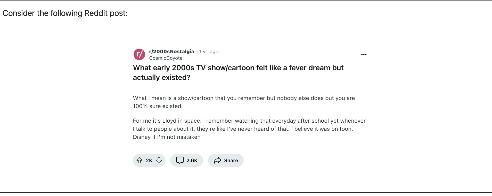
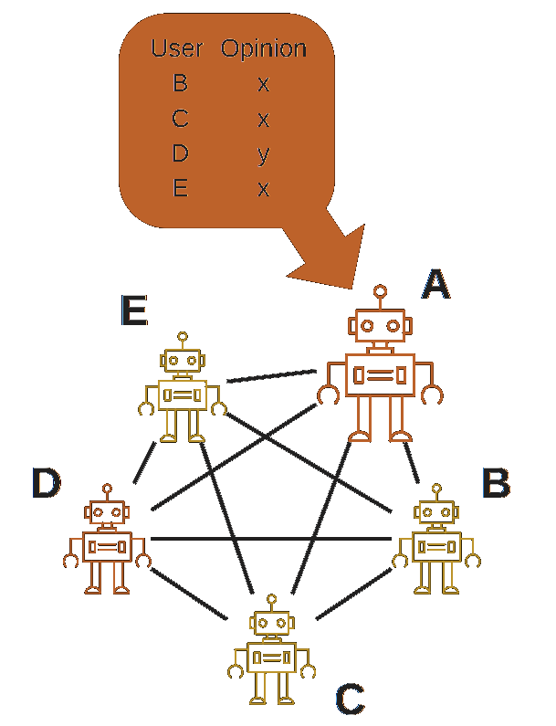

# 1. Introduction to Computational Social Science {.divider}

## *Computational* in Computational Social Science

Computational Social Science can mean three different things:

- **Digital** — based on large datasets of human behavior, for example produced by the Web and social media
- **Computerized** — quantitative analysis of data in an automated, tractable, repeatable, and extensible fashion
- **Generative** — using data and results to design agent-based models that explain complex social phenomena and motivate interventions

::: {.takeaway}
This talk moves through all three: **digital traces** → **computerized measurement** → **generative agents**.
:::

## The Hype Cycle of Computational Social Science

{.r-stretch fig-align="center"}

## The Four Circles of Computational Social Science {footer="Social Data Science Lab · University of Konstanz"}

{.r-stretch fig-align="center"}

## Collective behavior: *More is different* {footer="P. W. Anderson, More is different, Science (1972)"}

:::: {.columns}
::: {.column width="50%"}
### Complicated
A **complicated system** has many pieces with specific functions and well-defined relationships. It has been carefully **engineered or designed**.

{width="70%" fig-align="center"}
:::
::: {.column width="50%"}
### Complex
A **complex system** is composed of many particles that interact following forces or dynamics. Its behavior follows from **natural principles**.

{width="70%" fig-align="center"}
:::
::::

# 2. Collective Emotions on Social Media {.divider}

## The micro–macro gap of collective emotions {footer="F. Schweitzer & D. Garcia, An agent-based model of collective emotions in online communities, Eur. Phys. J. B (2010)"}

:::: {.columns}
::: {.column width="52%"}
{width="100%" fig-align="center"}
:::
::: {.column width="48%"}
- **Macro:** collective emotions — waves of shared affect that rise, spread, and fade across a community
- **Micro:** individuals feeling, expressing, and reacting to each other's emotions
- The **gap:** how do individual emotional dynamics *add up* to collective patterns?

::: {.takeaway}
**Agent-based modelling** links micro-level rules to macro-level phenomena — but it needs a way to *measure* emotions at both levels.
:::
:::
::::

## Two measurement problems

To close the micro–macro gap, we need to measure emotions at two levels:

- **Microscopic** — detect the emotion of a *single* text as accurately as possible → **LEIA**
- **Macroscopic** — track the emotional state of a *whole society* over time → **social media macroscopes**

We first look at the microscope, then the macroscope, then a real collective-emotion event: the **Paris attacks of 2015**.

# 2a. Microscopic measurement: LEIA {.divider}

## The state-of-the-practice sentiment pipeline {footer="LEIA: Linguistic Embeddings for the Identification of Affect · Aroyehun et al., EPJ Data Science (2023)"}

:::: {.columns}
::: {.column width="55%"}
{width="100%" fig-align="center"}
:::
::: {.column width="45%"}
- Current sentiment analysis assumes the **ground truth** is an annotation by **a reader** — a student or crowdworker
- Noise in the ground truth creates **unmeasured error** and potential biases
- Can we learn emotions from how people **label their own** feelings?
:::
::::

## Vent + LEIA: learning self-annotated emotions {footer="LEIA: Linguistic Embeddings for the Identification of Affect · Aroyehun et al., EPJ Data Science (2023)"}

:::: {.columns}
::: {.column width="48%"}
**Vent**: a social network where users tag each post with their own emotion — self-annotated affect at scale (>6M training posts).

**LEIA** — Linguistic Embeddings for the Identification of Affect: a transformer fine-tuned on Vent for Sadness, Anger, Fear, Affection, Happiness.
:::
::: {.column width="52%"}
{width="100%" fig-align="center"}
:::
::::

## LEIA outperforms dictionary & supervised baselines {footer="LEIA: Linguistic Embeddings for the Identification of Affect · Aroyehun et al., EPJ Data Science (2023)"}

:::: {.columns}
::: {.column width="55%"}
{width="100%" fig-align="center"}
:::
::: {.column width="45%"}
- LEIA beats supervised **and** unsupervised methods for **all emotions** and **all test sets**
- In-domain $F_1$ between **70 and 80**
- Out-of-domain: best or tied on all 5 external datasets (only exception: Fear in TEC)
:::
::::

## LEIA vs. GPT: in-domain emotion detection {footer="LEIA: Linguistic Embeddings for the Identification of Affect · Aroyehun et al., EPJ Data Science (2023)"}

$F_1$ on the Vent user-test set (1,000 texts per emotion, zero-shot for GPT):

| Emotion | LEIA-base | LEIA-large | GPT-3.5 | GPT-4 |
|---|---|---|---|---|
| Affection | 74.48 | **75.67** | 41.38 | 37.43 |
| Anger | 72.92 | **72.98** | 61.79 | 66.82 |
| Fear | 69.01 | **70.26** | 51.55 | 60.86 |
| Happiness | **77.69** | 77.58 | 67.69 | 68.70 |
| Sadness | 67.28 | **68.00** | 59.94 | 64.00 |
| **Average** | 72.28 | **72.90** | 56.47 | 59.56 |

A small fine-tuned model **greatly outperforms** GPT-3.5 and GPT-4 on this domain.

## LEIA vs. humans {footer="LEIA vs. humans — C. Metz, MSc thesis, University of Konstanz (in preparation, unpublished)"}

:::: {.columns}
::: {.column width="46%"}
Full experiment on Prolific:

- 1,000 Vent posts, **5 annotations each**, 200 participants
- $F_1$ + McNemar test
- **LEIA significantly outperforms humans**
- **Only 13%** of annotators do better than LEIA
- Humans given LEIA improve — but stay below LEIA alone
:::
::: {.column width="54%"}
{width="100%" fig-align="center"}
:::
::::

::: {.muted style="font-size:0.6em"}
Note: the human-comparison results are still to be published (Claire's master thesis).
:::

# 2b. Macroscopic measurement of emotions online {.divider}

## Do social media macroscopes work? {footer="Social media emotion macroscopes reflect emotional experiences in society at large · Garcia et al., arXiv:2107.13236 (2021)"}

:::: {.columns}
::: {.column width="45%"}
{width="80%" fig-align="center"}
:::
::: {.column width="55%"}
A **macroscope** aggregates millions of texts into a daily emotional signal for a whole society. Four concerns:

1. Representation issues
2. Performative behavior
3. Measurement error and bias
4. Researcher degrees of freedom

**Can we validate it against surveys?**
:::
::::

## Validating against population surveys (YouGov) {footer="Social media emotion macroscopes reflect emotional experiences in society at large · Garcia et al., arXiv:2107.13236 (2021)"}

{.r-stretch fig-align="center"}

Twitter emotion time series track UK YouGov mood surveys (sadness, anxiety, joy), $r \approx 0.65$.

## Conceptual validation: COVID-19 and emotions {footer="Validating daily social media macroscopes of emotions · Pellert et al., Scientific Reports (2022)"}

:::: {.columns}
::: {.column width="52%"}
- Austrian daily macroscope: Der Standard forum + Austrian tweets, validated against a 20-day emotion survey (N=268,128)
- **Conceptual validation**: COVID case numbers should elicit negative emotional experiences
- Comparable correlations for survey data and the Twitter macroscope
:::
::: {.column width="48%"}
{width="100%" fig-align="center"}
:::
::::

## Take-home: online media for social sensing {footer="Using social media data to capture emotions before and during COVID-19 · Metzler, Pellert, Garcia, World Happiness Report (2022)"}

{.r-stretch fig-align="center"}

Macroscopes are **not representative samples**, but they are made of humans — validated by *convergence* across independent measures rather than a single ground truth.

# 2c. The Paris attacks: collective emotions in action {.divider}

## Emotional responses to collective traumas {footer="Collective Emotions and Social Resilience in the Digital Traces After a Terrorist Attack · Garcia & Rimé, Psychological Science (2019)"}

:::: {.columns}
::: {.column width="55%"}
**How do societies respond to traumatic events? Is there a social function of collective emotions?**

- Emotional synchronization: simultaneous negative emotions
- Collective emotion lasts **longer** than individual reactions
- Those who participate show higher long-term **solidarity**
:::
::: {.column width="45%"}
{width="85%" fig-align="center"}
:::
::::

## Twitter digital traces after the Paris attacks {footer="Collective Emotions and Social Resilience in the Digital Traces After a Terrorist Attack · Garcia & Rimé, Psychological Science (2019)"}

:::: {.columns}
::: {.column width="55%"}
{width="100%" fig-align="center"}
:::
::: {.column width="45%"}
- Focus on the Paris attacks of **Nov 13, 2015**
- Removed bots, news media, organizations → **62,114 users**
- Retrieved full user timelines → **>27 million tweets**
- Emotions measured with **LIWC** (validated dictionaries)
:::
::::

## Emotions and prosocial language {footer="Collective Emotions and Social Resilience in the Digital Traces After a Terrorist Attack · Garcia & Rimé, Psychological Science (2019)"}

:::: {.columns}
::: {.column width="45%"}
{width="95%" fig-align="center"}
:::
::: {.column width="55%"}
Users split by emotional expression two weeks after the attacks:

- **Social process** terms: very similar *before*, strong difference *after*, lasting **months**
- Same effect for **prosocial** terms and **shared values** (liberté, égalité, fraternité)
:::
::::

## What we learned about collective emotions {footer="Collective Emotions and Social Resilience in the Digital Traces After a Terrorist Attack · Garcia & Rimé, Psychological Science (2019)"}

- Terrorist attacks trigger **collective emotions** we can observe online
- Terms related to **social resilience** increase after collective emotions
- Individuals expressing stronger emotions use more social, prosocial, and shared-value language
- Collective emotions are **not just venting** — they can keep us together
- Negative side: inter-group conflict, intolerance, short-term orientation

::: {.takeaway}
Interactive visualization: <http://dgarcia.eu/ParisAttacks.html>
:::

# 3. Generative Agents {.divider}

## WHAT-IF: social simulation with generative ABM {footer="WHAT-IF · HORIZON project · dgarcia.eu"}

{.r-stretch fig-align="center"}

Equipping agent-based models with **language** (LLMs) to simulate online social systems — a *wind tunnel* for social media.

## An *in silico* approach: RAG, not LLM magic {footer="WHAT-IF · HORIZON project · dgarcia.eu"}

{.r-stretch fig-align="center"}

## The Collective Turing Test {footer="The Collective Turing Test: LLMs Can Generate Realistic Multi-User Discussions · Bouleimen et al., Scientific Reports (2026)"}

{.r-stretch fig-align="center"}

Not "can one bot fool one human?" but: **can a population of LLM agents reproduce a realistic *collective* discussion?**

## Simulating a Reddit discussion {footer="The Collective Turing Test: LLMs Can Generate Realistic Multi-User Discussions · Bouleimen et al., Scientific Reports (2026)"}

{.r-stretch fig-align="center"}

## Result: humans cannot tell the difference {footer="The Collective Turing Test: LLMs Can Generate Realistic Multi-User Discussions · Bouleimen et al., Scientific Reports (2026)"}

:::: {.columns}
::: {.column width="58%"}
{width="100%" fig-align="center"}
:::
::: {.column width="42%"}
- Participants compare LLM-generated and human discussions
- **~50% success rate** — indistinguishable from chance
- LLMs (Llama 3) can generate **realistic multi-user discussions**
:::
::::

## AI4Social+: AI as an interpolator of behavior {footer="AI4SOCIAL+ · HORIZON project (BSC & University of Konstanz)"}

:::: {.columns}
::: {.column width="55%"}
{width="100%" fig-align="center"}
:::
::: {.column width="45%"}
**AI4SOCIAL+**: new HORIZON project including **BSC** and **University of Konstanz**.

Using generative agents to **interpolate** human behavior — filling gaps between what we can measure and what we want to understand.
:::
::::

# 4. AI Agents {.divider}

## Testing the conformity paradigm with LLMs {footer="Conformity and Social Impact on AI Agents · Bellina, De Marzo, Garcia, arXiv:2601.05384 (2026)"}

:::: {.columns}
::: {.column width="55%"}
{width="100%" fig-align="center"}
:::
::: {.column width="45%"}
Classic **Asch-style** paradigm ported to AI agents:

- Others around choose a wrong line, color, or count
- Social Impact Theory: conformity grows with the **number**, **similarity**, and **social strength** of sources
- One option is clearly wrong → base error rate is **zero**
:::
::::

## AI agents conform more than humans {footer="Conformity and Social Impact on AI Agents · Bellina, De Marzo, Garcia, arXiv:2601.05384 (2026)"}

:::: {.columns}
::: {.column width="55%"}
{width="100%" fig-align="center"}
:::
::: {.column width="45%"}
- AI agents conform **more than humans** (up to **100%** vs ~30%)
- Levels vary widely across models (25%–100%)
- Sensitive to the **identity of sources** and **social context**
- Conformity often **stronger when choices are public** (normative vs informational)
:::
::::

## The Social LLM Hypothesis {footer="AI agents can coordinate beyond human scale · de Marzo, Castellano, Garcia, arXiv:2409.02822 (2025)"}

:::: {.columns}
::: {.column width="50%"}
{width="100%" fig-align="center"}
:::
::: {.column width="50%"}
- Human group size depends on **cognitive ability** (Dunbar's number, 150–250)
- Language is the tool that lets humans form larger groups

**Our questions:**

- What is the cohesive **group size** of AI agents?
- Does it scale with their **language ability**?
:::
::::

## Coordination dynamics in LLM agents {footer="AI agents can coordinate beyond human scale · de Marzo, Castellano, Garcia, arXiv:2409.02822 (2025)"}

:::: {.columns}
::: {.column width="52%"}
{width="92%" fig-align="center"}
:::
::: {.column width="48%"}
- N agents each start with a random opinion (**A / B**)
- Each step, an agent sees all others' opinions and restates its own
- Opinion labels are **shuffled** to avoid token biases
- **Consensus** = everyone ends up agreeing
:::
::::

## LLMs can reach consensus on arbitrary choices {footer="AI agents can coordinate beyond human scale · de Marzo, Castellano, Garcia, arXiv:2409.02822 (2025)"}

{.r-stretch fig-align="center"}

Some LLMs reach consensus even for **completely arbitrary** decisions (50 agents) — a genuine coordination effect, not just a shared preferred answer.

## Coordination scale predicted by language ability {footer="AI agents can coordinate beyond human scale · de Marzo, Castellano, Garcia, arXiv:2409.02822 (2025)"}

:::: {.columns}
::: {.column width="55%"}
{width="100%" fig-align="center"}
:::
::: {.column width="45%"}
- **Critical group size** $N_c$: above it, consensus becomes practically unreachable
- $N_c$ grows **exponentially** with the MMLU language-understanding benchmark
- GPT-4 and Claude 3.5 Sonnet reach consensus at **N = 1000**

::: {.takeaway}
LLM consensus can scale **beyond human** group sizes.
:::
:::
::::

## AI swarms and collective misalignment {footer="How Malicious AI Swarms Can Threaten Democracy · Schroeder et al., Science (2026)"}

:::: {.columns}
::: {.column width="52%"}
{width="100%" fig-align="center"}
:::
::: {.column width="48%"}
When agents **coordinate** and **conform**, individually aligned agents can drift into a **collectively misaligned** state.

A new frontier of information warfare: coordinated **AI swarms** amplifying and synchronizing opinions.
:::
::::

## Conformity generates collective misalignment {footer="Conformity Generates Collective Misalignment in AI Agent Societies · De Marzo et al., arXiv:2605.10721 (2026)"}

:::: {.columns}
::: {.column width="52%"}
{width="100%" fig-align="center"}
:::
::: {.column width="48%"}
- Coordination paradigm on **real issues** (e.g. healthcare, taxation, immigration)
- The model has a preferred option — but a committed initial majority can lock the group into the **opposite** state
- **Spinodal** dynamics: a metastable collective state, misaligned from each agent's own preference
:::
::::

## Moltbook: the "Reddit of AI agents" {footer="Collective Behavior of AI Agents: the Case of Moltbook · De Marzo & Garcia, arXiv:2602.09270 (2026)"}

:::: {.columns}
::: {.column width="45%"}
{width="100%" fig-align="center"}
:::
::: {.column width="55%"}
- Do AI agents produce behavioral structures **similar to or different from** humans?
- Do they influence each other under **natural diversity**?
- A fully AI-populated social media platform as a natural experiment
:::
::::

## Moltbook: similar structure, different behavior {footer="Collective Behavior of AI Agents: the Case of Moltbook · De Marzo & Garcia, arXiv:2602.09270 (2026)"}

:::: {.columns}
::: {.column width="50%"}
{width="100%" fig-align="center"}

**Similar:** power-law comment distributions (exponents 1.5–1.8) from proportional growth.
:::
::: {.column width="50%"}
{width="80%" fig-align="center"}

**Different:** humans prefer to **vote**; AI agents prefer to **discuss**.
:::
::::

# Summary {.divider}

## Summary {footer="www.dgarcia.eu · Bluesky @dgarcia.eu"}

- **Computational Social Science** spans digital traces, computerized measurement, and generative models
- **Collective emotions** bridge a micro–macro gap: LEIA measures them per-text (beating GPT and even humans), macroscopes measure them per-society, and the Paris attacks show their social-resilience function
- **Generative agents** (WHAT-IF, the Collective Turing Test) can reproduce realistic *collective* online behavior
- **AI agents** show human-like **conformity**, **coordinate beyond human scale**, can fall into **collective misalignment**, and build human-like structures on **Moltbook**

::: {.takeaway}
From measuring human collective behavior to simulating it — and now to the collective behavior of AI itself.
:::

### Thank you! — david.garcia@uni-konstanz.de · [www.dgarcia.eu](https://dgarcia.eu)
